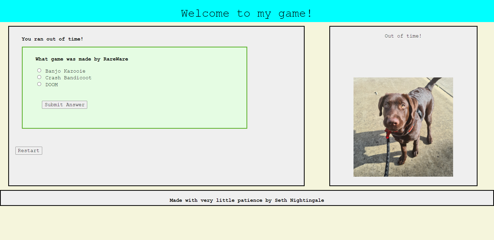

# Quiz-Time
I'm creating a game where the user will be given a quiz and a time limit. Incorrect guesses to the questions lower the remaining time and correct guesses advance to the next question.
This is a project set by UWA and will be graded when submitted.

Published site: https://cal750.github.io/Quiz-Time/

Screenshot of the site:  